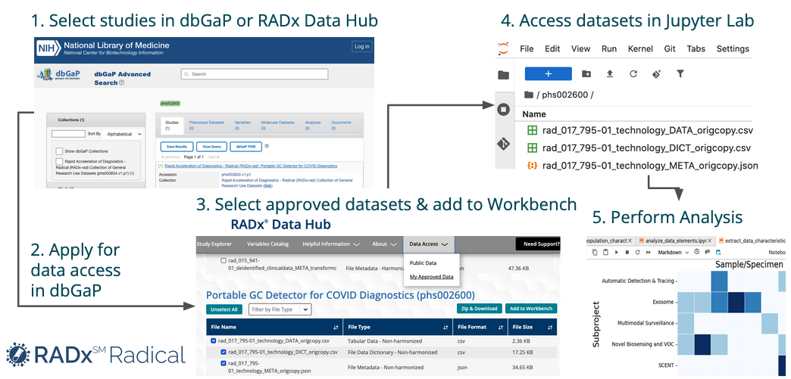

# radx-analyzer
## Comparative Analysis of Novel Diagnostic Methods for SARS-CoV-2 Detection and Surveillance

This project characterizes the data submitted to the [NIH RADx Data Hub](https://radxdatahub.nih.gov/) for the [RADx-rad](https://www.nih.gov/research-training/medical-research-initiatives/radx/radx-programs) program.

The RADx℠ Radical program (RADx-rad) is advancing non-traditional diagnostics to improve SARS-CoV-2 detection, surveillance, and response. This study compares novel diagnostic methods for detecting SARS-CoV-2 and its variants, including electronic noses (VOCs in breath), chemosensory testing (at-home olfactory assessment), and automatic detection technologies (microfluidic saliva assays for viral and antibody detection). It also evaluates technologies, such as electrochemical sensors, touch-based detection, mechanical detection, and aerosolized virus monitoring, alongside biosensing platforms like smart masks.

Methods are assessed based on analyte targets (spike protein, protease, antibodies), specimen types (saliva, blood, breath), and biophysical techniques. Key performance metrics include sensitivity, specificity, area under the curve (AUC), and limit of detection (LoD), with validation across diverse populations and SARS-CoV-2 variants. Cross-reactivity with common respiratory viruses such as influenza and human coronaviruses is also examined to ensure diagnostic specificity.

This comparative analysis will guide the selection of optimal diagnostics for point-of-care and at-home-testing, improving pandemic response and preparedness for COVID-19 and future infectious diseases. The innovative and complementary diagnostic methods developed by the RADx-rad program offer practical solutions for rapid deployment and scalable impact in real-world infectious disease surveillance.

[Summary of the analysis](docs/RADx_rad_use_case_2025-06-09.pptx.pdf)

## Workflow
The image below shows the workflow how to select and apply for access to RADx-rad datasets.


## Installation
This analyis is performed in  Jupyter Lab. Please review the NIH RADx Data Hub [Workbench tutorial](https://radxdatahub.nih.gov/workbenchTutorial?tutorial=jupyterLab) for details.

1. Login to the [NIH RADx Data Hub](https://radxdatahub.nih.gov/)
2. From the `Data Access` pulldown menu select `My Approved Data`.
3. Select all files and add them to the workbench
5. Create and Launch a JupyterLab Space ([instructions](https://radxdatahub.nih.gov/workbenchTutorial?tutorial=jupyterLab#create-space))
* Select Instance: `ml.t3.large` and Storage (GB): `100`
6. Clone this Git repository ([instructions](https://radxdatahub.nih.gov/workbenchTutorial?tutorial=jupyterLab#clone-git))
* Git URL: `https://github.com/radxrad/radx-analyzer.git`
7. Open a terminal window in Jupyter Lab
* Select `File->New->Terminal`
* Create a Conda environment
```conda env create -f environment.yml```
* Add the conda environment to the Jupyter kernel
```python -m ipykernel install –-user --name radx-analyzer```
* Verify installation of the kernel
```jupyter kernelspec list```

8. Log out of Jupyter Lab `File->Log Out`
9. Relaunch Jupyter Lab
10. Select the kernel `radx-analyzer`
11. Run the notebooks in numerical order (notebooks are numbered)


> **Note:** To avoid a timeout of your Jupyter Lab session after about 10 minutes of inactivity, run the `keep_alive` notebook until your work is complete. It will keep the session alive for 8 hours.

## Citation
Peter W. Rose, RADx-Analyzer: Comparative Analysis of Novel Diagnostic Methods for SARS-CoV-2 Detection and Surveillance. Available online: https://github.com/radxrad/radx-analyzer (2025).

## Funding
Development of this application was supported by the OFFICE OF THE DIRECTOR, NATIONAL INSTITUTES OF HEALTH:

**RADx-Rad Discoveries & Data: Consortium Coordination Center Program Organization** ([7U24LM013755](https://reporter.nih.gov/project-details/10745886))


